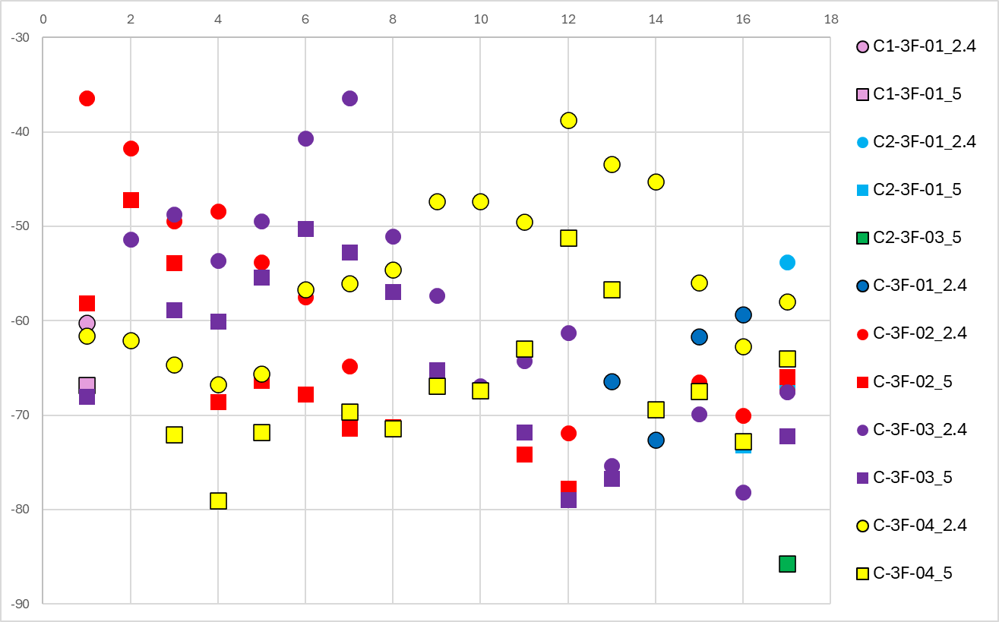

# 情報通信システム論Ⅰ・情報通信システム特論Ⅰ 
# グループB 進捗報告

## 提案する方法
1. 受信するアクセスポイントの名前から自分がどの棟にいるかを予想する
1. アクセスポイントの名前とその電波強度から大まかな位置を推定する関数を作成
   - データとして取得するのは電波強度が強い3~4個のアクセスポイント
   - うち使用するのは異なる位置にあるアクセスポイント2個
   - 取得するアクセスポイントの決定方法:図1を各階各棟（C,C2,C3）ごとに作成した上で決定
1. ファクタグラフ最適化を用いて、計測地点全体を最適化

## 現在までの進捗
- 方法の選定
- 図に示すような測定点とアクセスポイントの名前，電波強度の関係を示すグラフの作成

図1 各点の受信可能なアクセスポイントの名前とその電波強度

- 補正方法の選定
## これから行うこと
- 受信する3~4のアクセスポイントの名前とその強度から大体の位置を求める関数の提案
    1. 受信する最も強度の強いアクセスポイント上位3~4を取得
    1. その中から異なる位置にあるアクセスポイントで最も電波強度の強い上位2個選択
    1. 2個のアクセスポイントの電波強度から大まかな位置を推定
- ファクタグラフ最適化による補正
  - 「計測地点が棟内である」「隣接する計測地点の三次元位置が大きく離れることはない(スマートフォンのIMUからそのようなデータが得られると仮定)」といった拘束条件を活用するためファクタグラフ最適化による全体最適の実施を検討している
  - 計測地点が離散的で隣接する地点が関係を持つことから、各計測地点をノードとしたグラフとして考えることができ、それぞれのノードの持つ状態変数(三次元位置)が離れすぎることがないというファクタを張ることができる
  - マルチパスやノイズによる局所的な推定地点の悪化を補正することができると考える